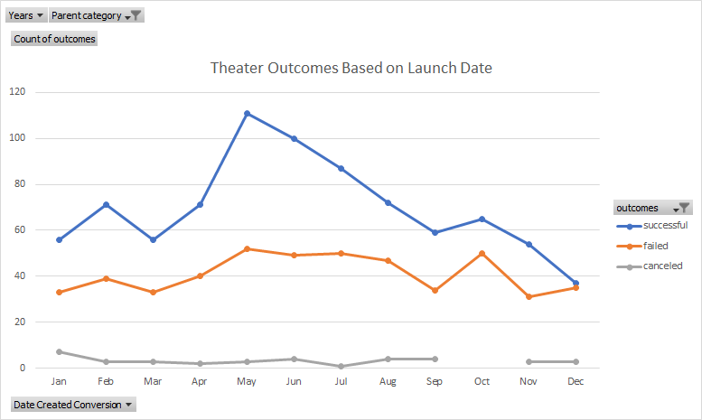
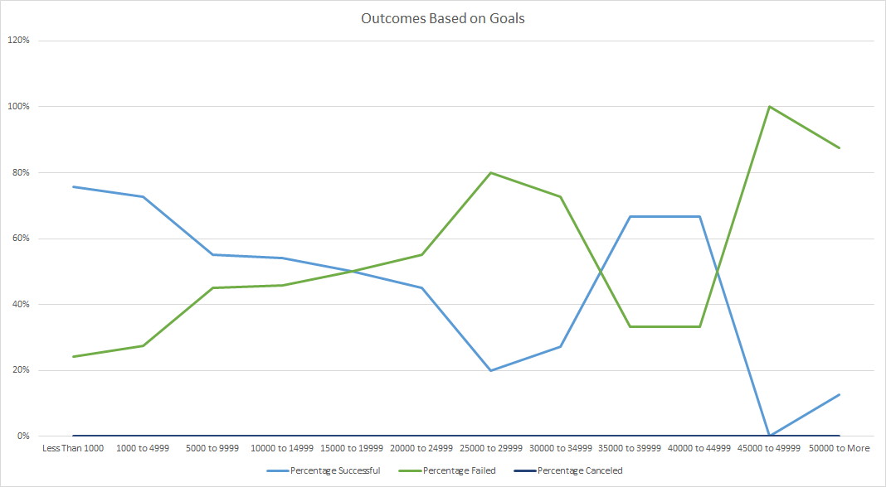

# Kickstarting with Excel

## Overview of Project

### Purpose
The data collected and organized in this project were created to help Louise make the best decision for funding a successfull Kickstarter Campaign. In the two analyses presented below, the data shows the outcomes of successful and unsuccessful Kickstarters based on either their launch dates or their financial goals. 
## Analysis and Challenges

### Analysis of Outcomes Based on Launch Date

The data represented above, shows the correlation between the three various outcomes (Successful, Failed, or Canceled) of theater Kickstarters and the date that they were launched.

### Analysis of Outcomes Based on Goals

The data represented above, shows the percentage of successful, failed, or canceled Kickstarter plays based on their proposed financial goals. 
### Challenges and Difficulties Encountered

## Results

- What are two conclusions you can draw about the Outcomes based on Launch Date?

- What can you conclude about the Outcomes based on Goals?

- What are some limitations of this dataset?

- What are some other possible tables and/or graphs that we could create?
